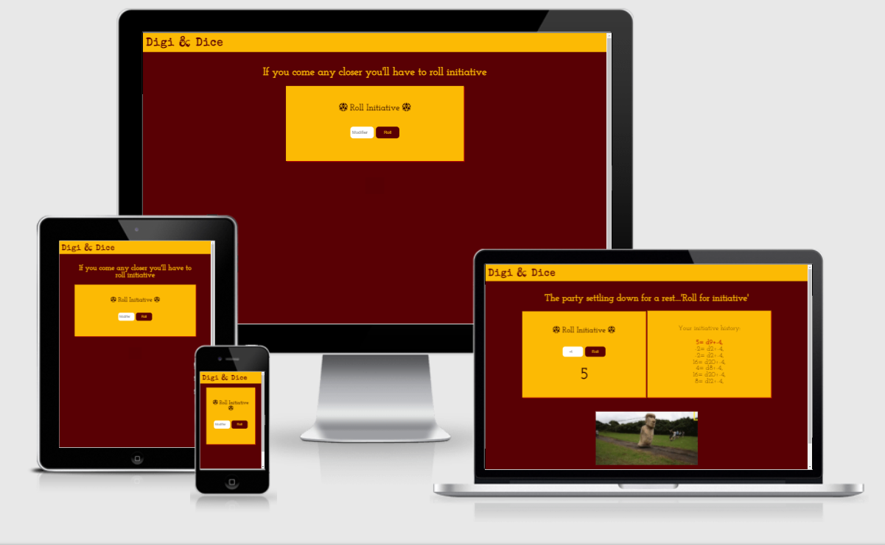
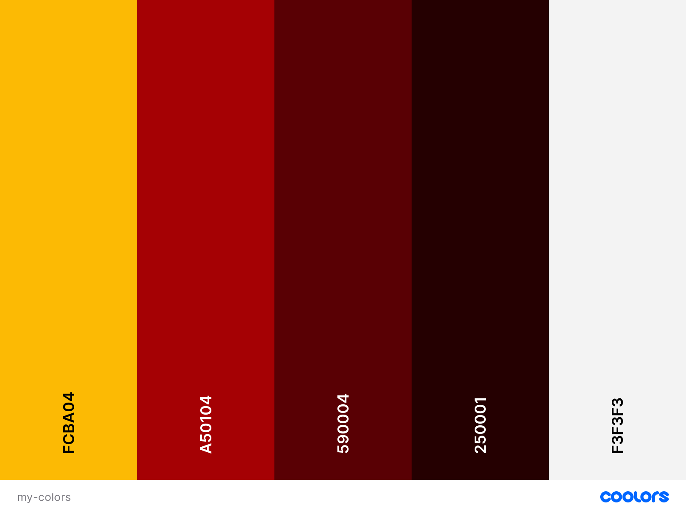

# Digi & Dice

## About Digi & Dice

Digi & Dice is an online initiative dice roller for table top and/or online Dungeons and Dragons player. Designed specifically for those days when you forget to pack you d20 for battle. 

The Digi & Dice project is a user centric interactive Front-End Development website. This is my second project as part of the Diploma in Software Development at Code Institute.

Link to live website: https://anabramos.github.io/Digi-n-Dice/

## Features

- Navigation Bar
    - The navigation bar is situated at the top of the page, with the logo of the Digi & Dice to the left. The logo brings the distinct dragon in the shape of the & that can be recognized by all true D&D players. 
    - The Digi & Dice logo also functions as an anchor link to the homepage.

- Quote section
    - As part of the interactivity of the page, the user will find a variety of quotes related to D&D coming back every 3 seconds to engage them with the website and attract their interest.
    - This feature is disabled for side-bar and mobile mode (screens with max-width of 620px).

- Initiative dice roll section
    - The dice roll functionality is build so that users can include their initiative modifiers and the initiative roll will calculate the sum of these two values. 
    - If no initiative modifier is provided when performing a dice roll, the user will receive as a result a reminder to add its modifier. 
    - When the user clicks on the dice roll button having added a valid initiative modifier value, they will receive as a response the total initiative value of their roll. 

- Initiative history section
    - The initiative history section will log the results of a user's initiative rolls up until a max. of 7 rolls. 
    - After 7 rolls, for every new dice roll the latest logged initiatives will be deleted, giving room for the newest one. 

- Initiative triggered gif section
    - Another interactive feature of Digi & Dice is the gif display triggered by the initiative value rolled.
    - For lower initiative values (initiative < 7) the section will display gifs that translate the slowliness of the action.
    - For medium initiative values (initiative > 7 && initiative < 13) the section will display gifs that translate the medium pace of the action.
    - For high initiative values (initiative > 13) the section will display gifs that translate the speediness of the action.
    - This feature is disabled for side-bar and mobile mode (screens with max-width of 620px). 

- Footer 
    - The footer credits the creator of the website. 

### Features to be implemented

- Implement an API for quote and gif generators
- Expand the dice roll beyond initiative rolls (d20) to include also d4, d6, d8, d10, and d12.

## Testing

### Component level Testing

- Compatibility & Responsiveness
    - The website was tested and it is working on different browsers: Google Chrome, Firefox, and Microsoft Edge.
    - Tested on different devices using Chrome DevTools and other available from myself and friends. 
    - The website is responsive on screen widths from 2560px to 320px.

- Header/Logo
    - The internal link in the logo is working and opening the home page as desired.

- Quote section
    - The quote section is working and displaying a random quote every 3 seconds. 

- Modifier input field
    - The modifier input field is working and will only accept number inputs.
    - The modifier input field is required, which means if the user does not fill in the calculation for initiative will not happen and the user will receive a message requiring to do so.

- Roll dice button
    - The button is working and providing the correct output based on the calculation it does.
    - When the button is clicked, it will trigger 3 things:
        - Display an initiative number or a request for the user to provide an initiative modifier;
        - Display the calculation of the initiative in the 'initiative history box' on the top of the list, with distinct style;
        - Display a gif that corresponds with the initiative number rolled. 

- Initiative history container
    - All initiatives rolled are being logged properly into the container, including being added to the top of the list in different styling.
    - The sum between the dice roll and initiative modifier is working correctly. 

### User level Testing
During a game friends of mine tested the website in their own mobiles, laptops, etc. 

 - Overall Navigation 
    - No issues reported.

- Website Responsiveness
    - Issue reported with horizontal scrolling caused by the footer content. Changes to address this issue were implemented by giving the footer a different content in smaller screen sizes. 
    - Issue reported with gifs that were either displaying in line with other containers or below it. Changes to address this issue were implemented by adding different styling to the div holding the gifs section.

- Dice roll section
    - No issues reported.

- Initiative history section
    - Issue reported with the way in which the initiative history is logged, which was displayed in line and not very transparent in regards to the dice roll. Changes to address this issue were implemented by displaying the initiative history log in a list format and presenting the entire calculation rather than just the initiative number. 

### Validator Testing

- HTML
    - No errors or warnings returned from the [W3C Markup Validator Service](https://validator.w3.org/)

- CSS
    - No errors or warnings returned from the [W3C CSS Validator Service](https://jigsaw.w3.org/css-validator/)

- Javascript
    - No errors, warnings or bugs returned from the [JSHint](https://jshint.com/)

### Accessibility

- The color pallet and contrast for the website was tested on [WebAIM](https://webaim.org/resources/contrastchecker/)
- The website has been tested on lighthouse for accessibility. 

## Design

- Colors
    - The website colors are inspired by D&D Fire dragons. It uses different shades of red and dark red with yellow details to create contrast between text and background.

        

- Fonts
    - The website uses a combination of Josefin Slab and Special Elite fonts, with a fall back to sans-serif. These fonts are popularly paired together. Special Elite is used in the website for high-level headings while Josefin Slab is used for regular text and low level headings. The fonts were compared and taken from [Google Fonts](https://fonts.google.com/).

- Icons
    - This website makes use of icons from [Font Awesome](https://fontawesome.com/) to give a new visual element and reference existing imagery from Dungeons and Dragons. The Icons are used to indicate the purpose of the website.

- Gifs
    - All gifs for this project were taken from [GIPHY](https://giphy.com/). 

## Technologies Used

- Languages
    - [HTML5](https://en.wikipedia.org/wiki/HTML)
    - [CSS](https://en.wikipedia.org/wiki/CSS)
    - [Javascript](https://en.wikipedia.org/wiki/JavaScript)

- Libraries & Frameworks
    - [Google Fonts](https://fonts.google.com/)
    - [Font Awesome](https://fontawesome.com/)

- Tools
    - [Gitpod](https://www.gitpod.io/)
    - [Github](https://github.com/)
    - [Google Chrome Developer Tools](https://developer.chrome.com/docs/devtools/)
    - [Coolors (color schemes generator)](https://coolors.co/)
    - [GIPHY](https://giphy.com/)
    - [W3C HTML Validation Service](https://validator.w3.org/)
    - [W3C CSS Validation Service](https://validator.w3.org/)
    - [Am I Responsive?](http://ami.responsivedesign.is/)
    - [WebAIM](https://webaim.org/resources/contrastchecker/)
    